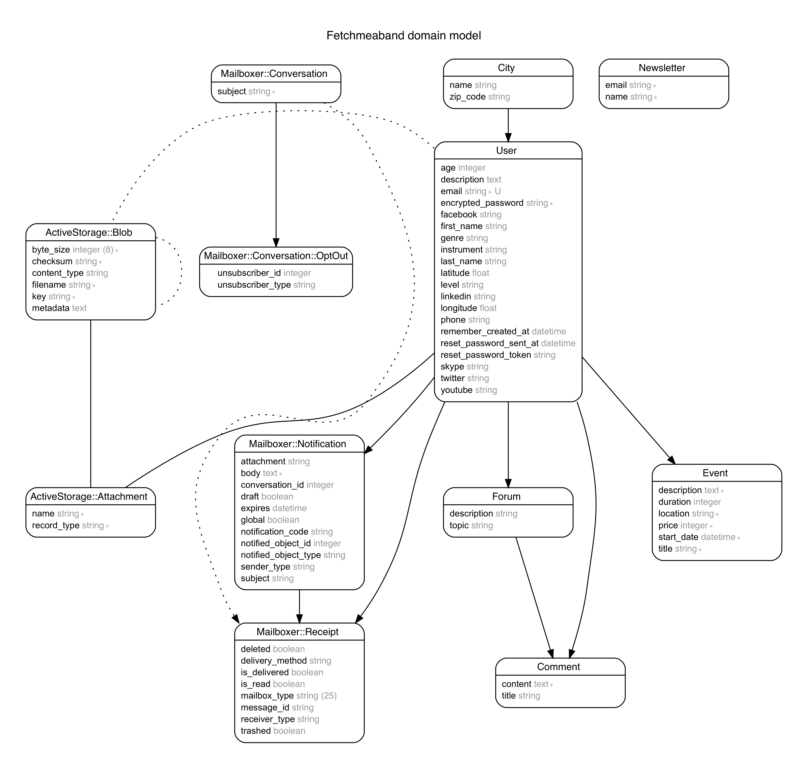

# README FETCH ME A BAND #

___
1- Github du groupe Fetch me a band

2- Site Heroku

3- On a fait un Wiki

* <https://github.com/JMD60260/fetchmeaband/wiki/Home/_edit>
* <https://fectchmeaband-pro.herokuapp.com> :boom:
* <https://git.heroku.com/fetchmeaband-pro.git> :boom:
* <https://fetchmeaband-staging.herokuapp.com>
* <https://git.heroku.com/fetchmeaband-staging.git>
  
___

* <https://www.facebook.com/fetchmeaband/>  :notes: :electric_plug: :tada:
* <https://twitter.com/FetchMeBand1> :notes: :electric_plug: :tada:
* <https://www.instagram.com/fetchmeaband/> :notes: :electric_plug: :tada:
___

- Ruby version 2.5.1
- Rails version 5.2.3
- CSS : Theme Bootstrap 
- API Utilisées:
  * Amazon S3
  * SendGrid

- Gems Interessantes:
  * Capistrano et Whenever pour la Newsletter automatique
  
## Contributeurs ##

- ©Jean-Baptiste DEMENET
- slack: @Jean-Baptiste :smile:
- ©Jasmine BANCHEREAU
- slack: @Jasmine Banchereau
- ©Nazanin FARSHAD
- slack: @Nazanin :disappointed:
- ©Jean-Marc DARDY
- slack: @JM :smile:
  
### Mentor ###

- Anthony Amar
- slack: @anthonyamar :rocket:
  
#### Projet fait grace a la formation ####

[©The Hackig Project](<https://www.thehackingproject.org/fr>) :alien:
  
##### Pour Github #####

- JM doit mettre en contributeur tout le monde
- dirige toi via ton terminal dans le dossier que tu souhaites
- git clone <https://github.com/JMD60260/fetchmeaband.git>
- cd fetchmeaband
- bundle install
- rails db:create
=> Puis pour commencer à travailler :
- git checkout master
- git pull origin master
- git branch nom_de_ta_branche
- git checkout nom_de_ta_branche
  
  Tu peux alors coder normalement / puis
  
- git add .
- git commit -m "ton commentaire"
  
##### Pour Merger #####

- git checkout master
- git pull origin master
- git checkout nom_de_ta_branche
- git merge master
- git checkout master
- git merge nom_de_ta_branche
- git push origin master

##### BDD View #####

___

##### TRELLO juste un aperu #####

___

___

##### Commande de Guillaume #####

